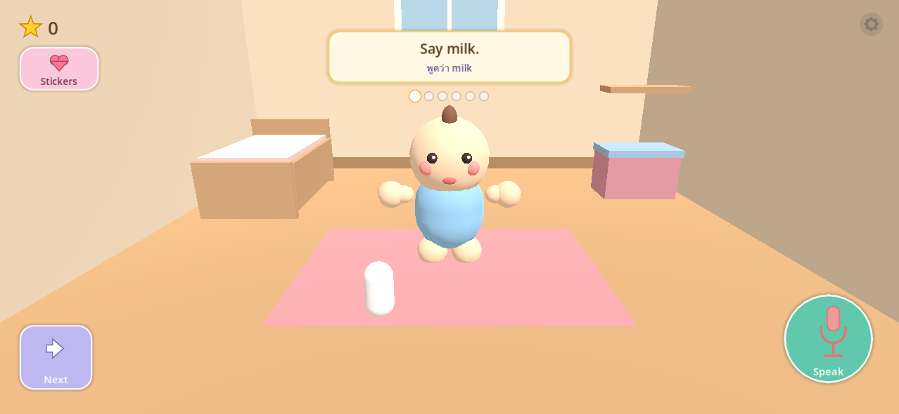
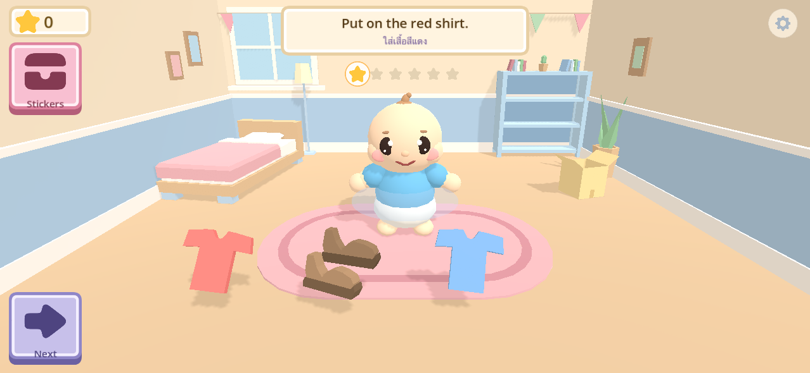
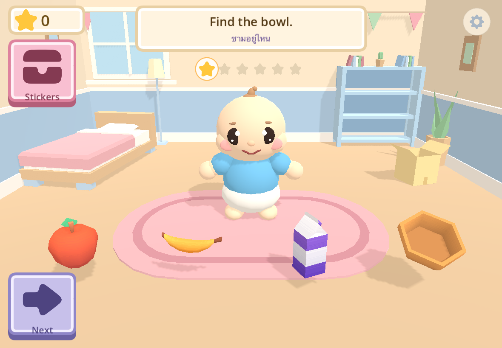

# Art Upgrade Report

**Period:** 2026-09-17 · **From** `96b6458` (end of overnight build) **to** `e8f30a3` (MacBook handoff)

Goal: turn a functional prototype into a cohesive, cute, child-facing presentation without
touching the offline-first architecture, the mission/content systems, or the working iOS
build pipeline.

---

## Before / after

**Before** — milk is a white capsule, the bed a plain box, the shelf a floating plank, no
shadows, dot-eyed baby with detached hands:

**After** — iPhone aspect (1278×590):

**After** — iPad aspect (1180×820):

App icon, before → after: a thin hand-drawn bottle on a rounded square → an originally
authored, opaque 1024×1024 master that still reads at 60 px:

---

## Assets added

| Category | What | Source | Licence |
|---|---|---|---|
| 3D props | Food Kit (apple, banana, bowl, spoon, cup, glass, carton) | Kenney | CC0 |
| 3D props | Cube Pets `animal-polar` → teddy (tinted brown) | Kenney | CC0 |
| 3D props | Minigolf `ball-red` | Kenney | CC0 |
| 3D room | Furniture Kit ×9 (bed, bookcase, rug, toy box, lamps, plants, books) | Kenney | CC0 |
| UI icons | Game Icon Pack (ship ~18 of 815) | Nieobie | CC0 |
| UI frames | UI Pack 2.0 9-slices, re-paletted to 6 pastel colourways, 2 corner scales | Kenney | CC0 |
| Audio | *unchanged* — 8 procedurally generated SFX | ours | n/a |
| App icon | new master + previews | ours | n/a |

**18 GLB models, 42 UI SVGs, 984 KB total assets.** Full per-asset table with paths and
modifications in `docs/ASSET_MANIFEST.md`.

### Licences

**Every third-party asset is CC0. Attribution is required for nothing.** Each pack ships its
`License.txt`/`LICENSE` alongside the assets, read from the downloaded archive rather than
from a web summary.

Deliberately excluded: **Quaternius** (licence changed to QAL v1.0 on 2026-08-28; §3(a) forbids
redistributing assets "regardless of how much the Assets have been modified" — their own FAQ
still says CC0, so the site contradicts itself), **Sketchfab**, **any CC-BY asset**, and
**Kenney Brick Kit** (studded variants are visually LEGO; trade-dress exposure).

---

## What was replaced

**All 28 vocabulary objects now have a model** — 11 sourced, 17 procedural. None fall back to a
bare primitive.

The decisive finding: the remaining primitives were **not neutral abstractions, they were wrong
concepts**. `redShirt`, `blueShirt`, `yellowShirt`, `pants` and `pajamas` were *the same cube* in
five colours — while the game teaches the word "square" with another cube. `bathToy` was a
yellow sphere while `ball` is a red sphere: two nouns, one shape. That is active mis-teaching,
which is why they all qualified under the "only fix what mis-teaches" rule.

Two data bugs surfaced with them: `soap`'s colour hex rendered **white** while its `colorWord`
said "pink", and `bathToy` carried `shapeWord: "circle"` — a duck is not a circle.

| Area | Before | After |
|---|---|---|
| Teaching props | coloured primitives | 11 Kenney models + 17 procedural, all semantically correct |
| Nursery | 3 flat walls, box bed, plank shelf | wainscot + rail around all 3 walls, window, bed, bookcase, rug, toy box, plants, bunting, soft shadows |
| Baby | dot eyes, dark crown, detached hands | big eyes with catchlights, state-driven eyebrows, nose, mouth that swaps shape, onesie + nappy, feet, connected arms, blink |
| UI | hand-drawn `_draw()` glyphs, mixed styles | one Nieobie icon family, Kenney 9-slices in 6 pastel colourways at 2 corner scales |
| Stickers | 16 hand-drawn polygons | 11 real glyphs + 5 polygons |
| Progress | plain dots | shared gold star, filled / current / ghost |
| App icon | thin placeholder | originally authored, opaque, readable at 60 px |

---

## Rendering bugs found and fixed

Several were invisible to the test suite and only showed up in rendered screenshots.

1. **The back-wall wainscot had never rendered** — it sat at `z = −1.92`, *behind* the wall face
   at `z = −1.90`. Same on both side skirtings. Invisible since the scene was first written.
2. **`_draw()` only records commands**; the renderer binds textures later in the frame. A glyph
   held in nothing but a local dropped to zero refs and the renderer fell back to its 1×1 white
   texture — **every sticker painted as a solid coloured square.**
3. **Kenney frame art is authored as two halves joined near x=27**, leaving vertices 0.05 units
   off the straight edge. Invisible at 1:1, but the nine-patch stretched that antialiased column
   across the whole panel and smeared it into a **visible dimple in every panel border**.
4. **`Celebration` never respected the SafeArea.** `set_anchors_preset()` defaults `keep_offsets`
   to `true`, so the node kept zero size and silently fell back to the whole viewport. It only
   *looked* centred — and drew its sticker card over the baby's face.
5. **Celebration stars burst inside the sticker card's bottom edge** and rose behind it, so most
   of the reward moment was invisible.
6. **Kenney furniture pivots are corners, not centres**, which put the rug beside the baby and
   the bed inside the keep-out volume on first placement.
7. **`font_hover_pressed_color` fell through to the engine theme's near-white** on every parent
   toggle — reachable on iOS because touch synthesises hover. Caught by a new WCAG contrast test.
8. **The baby's first smile had inverted Z-rotation signs**, building a perfectly symmetrical
   **frown** on a character whose idle state is meant to be content. It survived three render
   passes before being spotted.
9. **The prism cap used a triangle fan**, which is only valid for outlines star-shaped about the
   origin — a t-shirt's neck notch and a shoe's ankle scoop are not, so the caps came out
   inside-out. Replaced with `Geometry2D.triangulate_polygon()`.

---

## Still placeholder / known visual limitations

| Severity | Item |
|---|---|
| Medium | **5 of 16 stickers** (banana, soap, towel, toothbrush, pillow) are still hand-drawn polygons sitting next to 11 professional glyphs. Visibly hand-made; the toothbrush reads ambiguously. No matching glyph exists in the 815-icon pack — a pear is not a banana, a paint brush is not a toothbrush. **Needs drawn or commissioned art.** |
| Medium | **`shoes` is the weakest 3D object** — readable when told, "two brown pebbles" cold. Went through 3 shape revisions and 8 presentation angles. Best candidate for a purchased or commissioned asset. |
| Medium | **Nursery silhouettes are still harder-edged** than the rounded props and baby. Retinting fixed the palette completely; it cannot fix geometry. **Tiny Treats "Playful Bedroom" ($7.95, CC0) is the intended fix** — needs a human purchase. Swap procedure and an enforcing test in `docs/NURSERY_SWAP_CONTRACT.md`. |
| Low | Sticker-button icon is a treasure chest — a compromise; no sticker-sheet glyph exists. |
| Low | `"1 / 16"` on the sticker book is a fraction on a pre-reader's screen. Deliberate (collection progress, not a score) but worth a decision. |
| Low | Speak button's `round_mint` frame is a single stretched texture, not a nine-patch; will distort if made non-square. |
| Low | Bowl rim is visibly hexagonal; `water` reads as "blue cup" in isolation. |
| Low | Nursery: floor lamp nearly vanishes at phone aspect; bookcase shelves empty; wall art low-contrast; bed reads as a daybed, not a cot. |
| Low | The baby is **procedural and temporary by design** — commission spec at `docs/CUSTOM_BABY_SPEC.md`. Kenney Mini Characters was tried and rejected: its arms import broken in Godot 4.7.2 before any modification, and it is a chibi adult with clothing baked into the atlas. |

---

## Regression status

| Check | Result |
|---|---|
| Godot project load | **zero errors** |
| Test suite | **PASS — 30 cases, 0 failures** (was 24 before the art work) |
| iOS export | clean |
| `xcodebuild` arm64 device | `** BUILD SUCCEEDED **` |
| Universal iPhone + iPad | `UIDeviceFamily = 1,2` preserved |
| Team ID / signing | `JZDAUN45CF`, automatic signing preserved |
| Offline-first | no network APIs anywhere in `game/` |
| Mission/content systems | untouched; 5 categories, 43 tasks, 46 words, 7 missions, 16 stickers intact |
| Performance | ~14k tris, 158 draw calls, exactly 1 `DirectionalLight3D` |

New tests added during this work: `nursery_contract` (mutation-tested), `ui_chrome`,
`ui_stickers`, `ui_contrast` (true WCAG relative luminance), `assets_models`, `baby_view_3d`.

---

## Physical-device checks still needed

**Nothing in this report has been verified on real hardware.** Every render was produced on
macOS at two window sizes.

- [ ] **Speech end-to-end** — the one blocking item. Mechanically verified in the shipped binary
      (framework linked, entry symbol bound, `setRequiresOnDeviceRecognition:` present, **zero
      networking frameworks linked**) but **no permission prompt or recognition has ever been
      observed.** Do not claim speech works until it runs on an iPhone.
- [ ] App icon on a real home screen, over a busy wallpaper.
- [ ] Safe-area insets on a notched iPhone, in **both** landscape rotations — the notch-side
      flip has never been seen. `test_ui_chrome` checks stored geometry at two aspect ratios,
      which is not the same thing.
- [ ] Touch-target comfort for an actual small child (measured 240×240 px, but that is arithmetic).
- [ ] Frame rate with shadows enabled on the oldest target device.
- [ ] Colour and contrast under real screen brightness — the palette is deliberately pastel.

Full device checklist: `docs/OVERNIGHT_BUILD_REPORT.md` §9 and `docs/MACBOOK_HANDOFF.md`.
