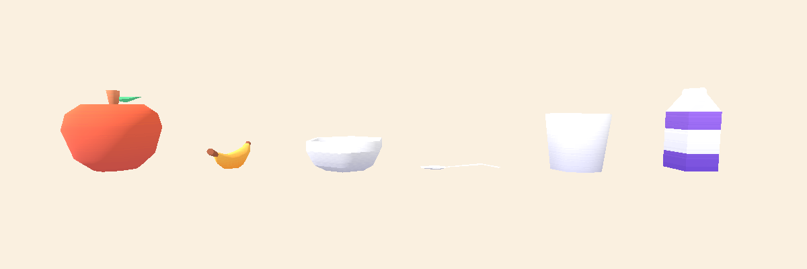

# Little Buddy — Asset Sourcing Plan

**Date:** 2026-09-17
**Purpose:** replace primitive placeholders with real, commercially-usable assets so objects
visually read as the English word being taught.

> **Verification standard used here.** Every licence below was read from the actual page or
> from the `License.txt` inside the actually-downloaded archive, and is quoted verbatim.
> Nothing is stated from memory. Where something could not be verified it is marked
> **UNVERIFIED**. Three independent research passes plus my own direct fetches agreed on the
> Quaternius finding in §3, which contradicts what every search engine currently says.

---

## 1. Chosen art direction (Task 2) — ONE family

**Kenney (kenney.nl) is the base family for all 3D.**

Cute stylised low-poly, flat-shaded, rounded, readable silhouettes, shared pastel palette
atlas. Chosen over the alternatives because:

1. **It is the only source that covers characters + food + toys + furniture in one visual
   language.** Coherence was the explicit requirement; no other source spans that range.
2. **Hard evidence of coherence, not a taste judgement:** Kenney Mini Characters, Minigolf Kit
   and Mini Market ship the **byte-identical `colormap.png`** (md5 `76084aa0c65d`, 512×512).
   Food Kit, Cube Pets, Holiday Kit and Brick Kit use the same 512×512 palette-stripe format.
3. **CC0 with no attribution obligation**, and **no redistribution clause** — so committing the
   files to this repo is unambiguously fine even if the repo ever goes public.
4. **Native GLB**, direct `curl`-able downloads, no login, mobile-grade polycounts
   (apple 136 tris, Cube Pet 522, Mini Character 876).

**Rejected as the base family:** Quaternius (licence changed — §3; also ships **no GLTF at
all**, and the style is adult/realistic), Poly Pizza as a primary (per-model licences,
inconsistent labels), Sketchfab (nothing unambiguous + well-fitting), OpenGameArt (no
coherent family — its top "furniture" hit is literally Kenney re-uploaded).

---

## 2. Verified evidence that this actually fixes the problem

Downloaded Kenney Food Kit, imported into a scratch Godot **4.7.2** project with the Mobile
renderer, and rendered. This is the acceptance criterion from the brief — *"the object must
visually read as the word being taught."*

Left to right: **apple** (red, green leaf, brown stem), **banana** (yellow, curved, stemmed),
**bowl**, **spoon**, **cup**, **milk carton**. Compare with what ships today: a banana is a
yellow capsule and a bowl is a cylinder.

**One caveat visible in that render:** the **spoon reads poorly edge-on**. It is a flat object
and needs a tilted presentation rotation to be recognisable. Noted as an implementation task,
not an asset problem.

---

## 3. ⚠️ Quaternius is NO LONGER CC0 — decision recorded

Every search engine and Quaternius' own FAQ still says CC0. **The canonical licence page does
not.** Fetched directly from <https://quaternius.com/license.html>:

> **Quaternius Asset License (QAL) v1.0 — Last updated: 8/28/2026**
> *"You can use these assets, free of charge, in personal, educational, and commercial games
> and other projects, with no credit required. You just can't resell or redistribute the
> assets themselves as assets."*
>
> §3(a): *"You may not extract, repackage, sublicense, sell, or otherwise redistribute the
> Assets (in original or modified form) as a standalone asset, asset pack, stock file,
> template, or similar product… **This restriction applies regardless of how much the Assets
> have been modified.**"*
>
> §7: *"Changes will not apply retroactively to Assets you've already obtained under an
> earlier version; the version in effect at the time you obtained the Assets governs."*

The site contradicts itself in at least four places — `faq.html` and the individual pack pages
still show a CC0 badge.

**Decision: do not use Quaternius at all.** QAL would still permit shipping the game, but:
- §3(a) makes **committing raw Quaternius files to this git repo legally questionable** if the
  repo is ever public — the assets sit there separable from the compiled Product.
- They ship **no GLTF/GLB**, only FBX/OBJ/blend, behind a Google Drive browser flow.
- The style is adult/realistic and wrong for the brief anyway.

There is a fully CC0 path that meets every need, so there is no reason to take this risk.

---

## 4. Approved packs — all CC0, all verified, all direct download

| # | Source | Pack | Licence (verbatim) | Attribution | Covers | Format | Size | Import risk |
|---|---|---|---|---|---|---|---|---|
| 1 | Kenney | **Food Kit (2.0)**  <https://kenney.nl/assets/food-kit> | `License: (Creative Commons Zero, CC0)` · *"You can use this content for personal, educational, and commercial purposes."* · *"Support by crediting 'Kenney'… (this is not a requirement)"* | **No** | **apple, banana, bowl (+soup/broth), utensil-spoon, cup, mug, carton (milk), glass, bread, cookie, egg** — 200 GLB | GLB/FBX/OBJ | 4.4 MB | **External texture** — see §6 |
| 2 | Kenney | **Cube Pets (2.0)**  <https://kenney.nl/assets/cube-pets> | Same CC0 text in bundled `License.txt` | **No** | **teddy** (`animal-polar`, 522 tris, 8 animations) + 23 more animals | GLB | 2.7 MB | pivot minY = −0.300 |
| 3 | Kenney | **Mini Characters (1.0)**  <https://kenney.nl/assets/mini-characters> | Same CC0 text | **No** | **the baby base** — 12 chibi humans, 7-bone rig, 32 animations incl. `sit`, `pick-up`, `emote-yes` | GLB | 2.3 MB | 876 tris, 0.78 m tall |
| 4 | Kenney | **Furniture Kit (2.0)**  <https://kenney.nl/assets/furniture-kit> | `License: (Creative Commons Zero, CC0)` · *"free to use in personal, educational and commercial projects"* | **No** | bed, bath, toilet, rug, bookcase, lamps, **pillow**, books — 140 models | GLB/FBX/OBJ/DAE/STL | 4.9 MB | **Untextured**, per-part materials — retint to pastel. Background only. |
| 5 | Kenney | **Minigolf Kit**  <https://kenney.nl/assets/minigolf-kit> | Same CC0 text | **No** | **ball** (`ball-red/blue/green`) | GLB | 3.0 MB | ball is 7 cm — rescale |
| 6 | Kenney | **UI Pack (2.0)**  <https://kenney.nl/assets/ui-pack> | `License: (Creative Commons Zero, CC0)` · *"This content is free to use in personal, educational and commercial projects."* · *"crediting Kenney… (this is not mandatory)"* | **No** | 9-slice **buttons/panels/sliders**, 82 assets × 6 colourways | SVG + PNG 1×/2× | 1.2 MB | Not pastel — re-palette 4 hex values |
| 7 | Nieobie | **Game Icon Pack**  <https://github.com/Nieobie/game-icon-pack> | Repo ships full `CC0 1.0 Universal` legal code; GitHub API `spdx_id: CC0-1.0`; itch field *"Creative Commons Zero v1.0 Universal"* | **No** | **815 icons** — mic, star, gear, heart, lock, arrows, play/pause, book, **milk**, bear | SVG (+PNG 64/128/256) | 1.0 MB | `fill="currentColor"` → resolves **black**; must `sed` to `#ffffff` before tinting |
| 8 | Tiny Treats | **Bubbly Bathroom**  <https://tinytreats.itch.io/bubbly-bathroom> | itch field *"Creative Commons Zero v1.0 Universal"*; body *"Free for personal and commercial use, no attribution required. (CC0 Licensed)"* | **No** | **soap, towel, toothbrush**, bath, rubber duck | OBJ/FBX/GLTF | 5.4 MB | **Browser download only**; ~0.01 node scale; slight style delta |

Packs 1–7 were downloaded and inspected locally. Pack 8 is free but **cannot be fetched
non-interactively** (itch browser flow).

### Art-style fit — honest grading

| Pack | Fit | Note |
|---|---|---|
| Food Kit, Cube Pets, Mini Characters, Minigolf | **Excellent** | Shared palette atlas, rounded, pastel, cute. Cube Pets is the cutest CC0 thing found anywhere. |
| Nieobie icons | **Excellent** | Stroke-free, fully rounded, plump silhouettes. All 815 on one `0 0 10 10` grid, so they optically match. |
| Kenney UI Pack | **Good shape, wrong colour** | Correct chunky pre-reader button forms; saturated arcade palette. Flat SVG fills → 4-value re-palette fixes it. |
| Tiny Treats Bubbly Bathroom | **Good, slight delta** | Softer/smoother than Kenney. Acceptable on three low-prominence bath props. |
| Kenney Furniture Kit | **Mediocre** | 2018-era, sharp edges, adult proportions, not pastel. **Untextured**, so retinting is easy. Background only, never a hero prop. |

---

## 5. Audio — keep what we have (evidence-based)

**Recommendation: do NOT replace the 8 generated WAVs.** This was measured, not assumed.

Our generated set: peak never above −6 dBFS, attack never under 5 ms, and **every file starts
and ends at exactly 0.0000** — mathematically click-free.

Kenney "Interface Sounds" (CC0) measured: `confirmation_003` peak **−1.4 dBFS** with a **first
sample of 0.8550** — an instantaneous 86%-of-full-scale DC step, i.e. an audible snap on every
play. Several candidates are 5–13 dB hotter than ours. For a small child that is worse, not
better.

Two further reasons: `wav_loader.gd` hand-parses RIFF and accepts only 16-bit PCM WAV (OGG
would break the headless test path), and **zero third-party audio means zero audio licence
surface** for a commercial children's product.

**Optional, later:** Kenney *Music Jingles* `PIZZI00/01/05/10` (CC0) measured clean
(edge0 ≈ 0.0001, soft attack) and would work as a longer session-summary stinger, trimmed ~3 dB.

---

## 6. Import gotchas already hit and solved

1. **Kenney GLBs are not self-contained.** They reference an external `Textures/colormap.png`
   relative to the model. Copying only the `.glb` files produced
   `ERROR: Can't open file from path 'res://models/Textures/colormap.png'` and rendered
   everything flat white ([evidence](images/kenney-food-kit-untextured.png)). **The
   `Textures/` folder must be copied alongside.**
2. **Godot caches a failed import.** After adding the texture, `--import` did nothing because
   the GLB hash was unchanged. Had to delete `.godot/` and the `.import` files to force a
   clean reimport.
3. **Nieobie `fill="currentColor"` resolves to BLACK**, and `modulate` multiplies — so tinting
   silently fails. `sed` `currentColor` → `#ffffff` first.
4. **SVG imports at 24×24 by default.** Set `svg/scale` in the `.import` (≈12–15 for a retina
   child-sized button).
5. **Scale is NOT consistent between Kenney packs.** Measured: banana 0.63 m long, ball 7 cm,
   a Cube Pet is 2× taller than a Mini Character. Food Kit pivots are reliably Y=0; Cube Pets
   (−0.300) and Furniture Kit (−0.130) are not. **Author an explicit per-prop scale and offset.**
6. **Orientation is fine** — all Kenney GLBs are Y-up/−Z-forward, correct for Godot.

---

## 7. Gaps where no suitable licensed asset exists

| Gap | Status | Resolution |
|---|---|---|
| **Baby / toddler** | 🔴 **No CC0 or CC-BY baby exists on any allowed source.** Searched Poly Pizza (`baby`/`toddler`/`child`), OpenGameArt, itch.io, Kenney's ~50 packs, Quaternius' ~90 packs. | Reproportion a **Kenney Mini Character** at runtime via `Skeleton3D.set_bone_pose_scale()` — head ×1.3–1.4, legs ×0.6–0.7. Stays CC0, in-family, keeps 32 animations. **Needs your decision — see §9.** |
| **Clothing** (shirt/pants/shoes/hat/pyjamas) | 🔴 No coherent pack anywhere. Only scattered CC-BY Google Poly one-offs, each a different author/style. **Pyjamas do not exist at all.** Kenney Mini Characters bake clothing into the atlas — it cannot be swapped. | **Teach clothing as 2D illustrated cards in the UI layer.** Legitimate for a vocabulary word, and sidesteps both the licence mess and the rigging problem. |
| **Crib / cot** | 🟠 Only CC-BY realistic cribs; stylistically incompatible. | Use Furniture Kit `bedSingle` retinted, or model a simple crib. |
| **Baby milk bottle** | 🟠 Not in Kenney. | Kenney `carton` already reads as milk. Optionally the **MiniPoly Baby Bottle** (CC0, <https://poly.pizza/m/JfV0hnRyAt>) — 616 tris, but **strip its Emission map** or it glows. |
| **Blanket** | 🟠 Kenney `bedroll` is brown camping canvas. | A rounded box with a soft pastel material is fine and quick. |
| **Shape sorter** | 🟠 Nothing suitable. | **Build procedurally** — a box with circle/square/triangle holes is trivial and reads perfectly. Procedural genuinely beats sourcing here. |
| **Sticker/album icon** | 🟠 Absent from all ~1,400 icons enumerated. | Substitute Nieobie `book`, `grid` or `image`. |

---

## 8. Legal notes

1. **Quaternius — avoid entirely** (§3).
2. **Kenney Brick Kit carries LEGO trade-dress exposure.** The `square-*`/`round-*` stud
   variants are visually LEGO bricks, and LEGO has litigated brick trade dress in multiple
   jurisdictions. If blocks are needed, use the **studless `none-*` or `bevel-*`** variants and
   stay off LEGO's signature palette. **This is a legal judgement, not mine to make.**
3. **Poly Pizza licence labels are uploader-declared and demonstrably inconsistent** — the same
   Tiny Treats "Charming Kitchen" pack has models tagged CC0 *and* CC-BY on the same page.
   Always prefer the original creator's pack page.
4. **Zero CC-BY is achievable here — take it.** Every CC-BY asset adds a perpetual attribution
   obligation to a shipped children's app. The plan above requires **no attribution at all**.

Optional courtesy credit line (not required by any licence):
> *3D assets by Kenney (www.kenney.nl) — CC0. UI icons: Game Icon Pack by Nieobie — CC0.
> Bathroom props: Tiny Treats by Isa Lousberg — CC0.*

---

## 9. Decisions that need you (everything else I will proceed with)

1. **The baby character.** No CC0 baby exists. Options, in my order of preference:
   (a) reproportion a Kenney Mini Character — free, CC0, in-family, keeps animations;
   (b) commission one model to match the Kenney atlas — bounded cost, you own it outright;
   (c) change the design so the cared-for character is a **Cube Pets animal** instead of a human
   baby — the cutest CC0 option by far, but it is a **product decision, not an art decision**.
2. **Tiny Treats "Playful Bedroom"** ($7.95, CC0) is the single best style match for the room
   and would beat retinted Kenney furniture. **I cannot purchase it.** Say the word and you buy
   + download it; otherwise I use Kenney Furniture Kit retinted.
3. **Brick Kit / LEGO trade dress** — your call whether to include blocks at all.

---

## 10. Where I disagree with the stated priority order

The brief lists **baby first**. Based on the rendered evidence I think that is the wrong order.

The current procedural baby already reads as cute and is the **most** successful thing in the
scene. The glaring failures are the **props** (a banana that is a yellow capsule) and the
**furniture** (a bed that is a plain box) — and those are exactly what Kenney fixes outright,
today, for free.

**Proposed order:** teaching props → room furniture → UI icons/buttons → teddy → baby last.
That front-loads the most visible improvement and leaves the one genuine gap (the baby) until
after you have decided §9.1. I will proceed this way unless you say otherwise.
