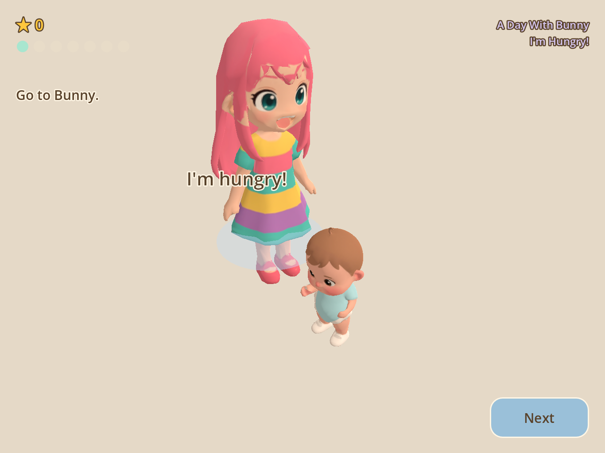
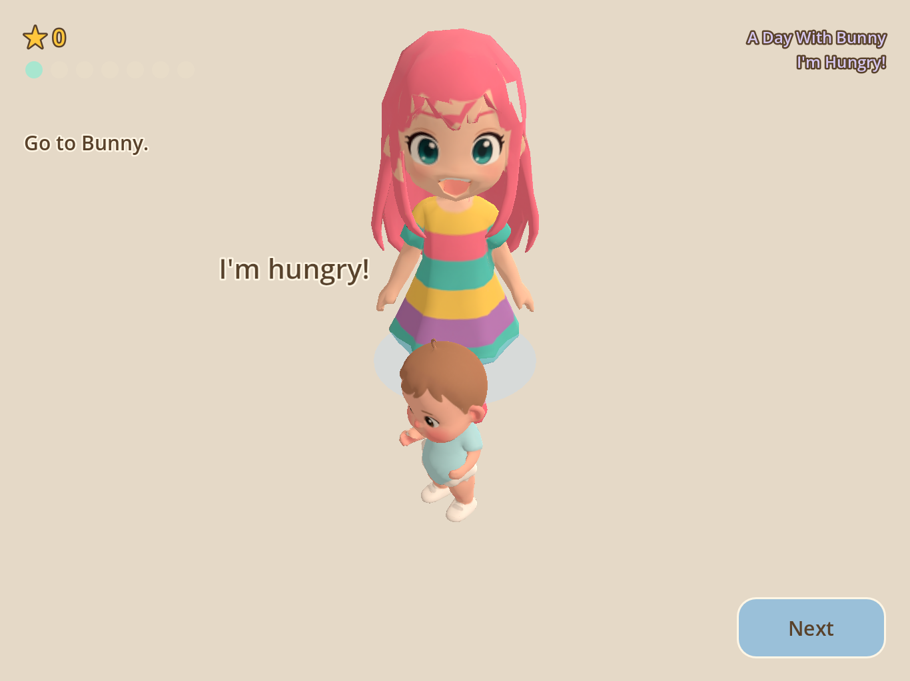
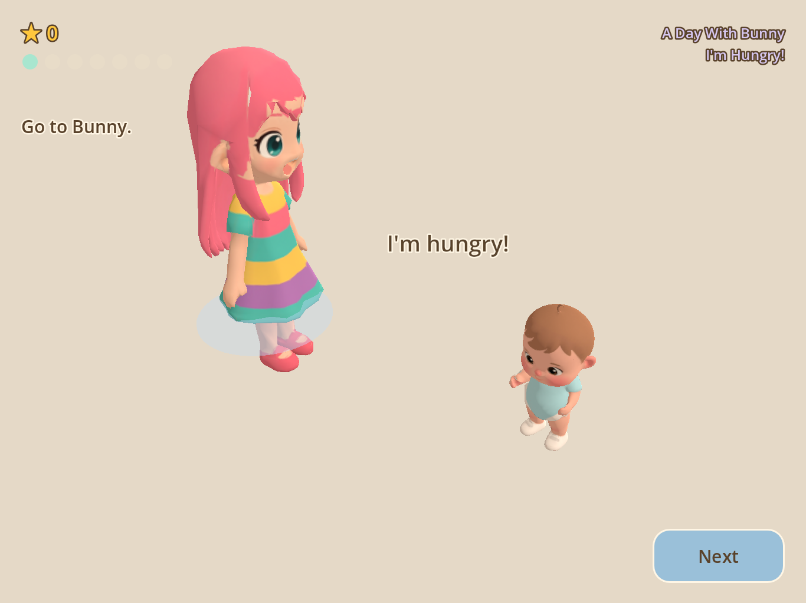
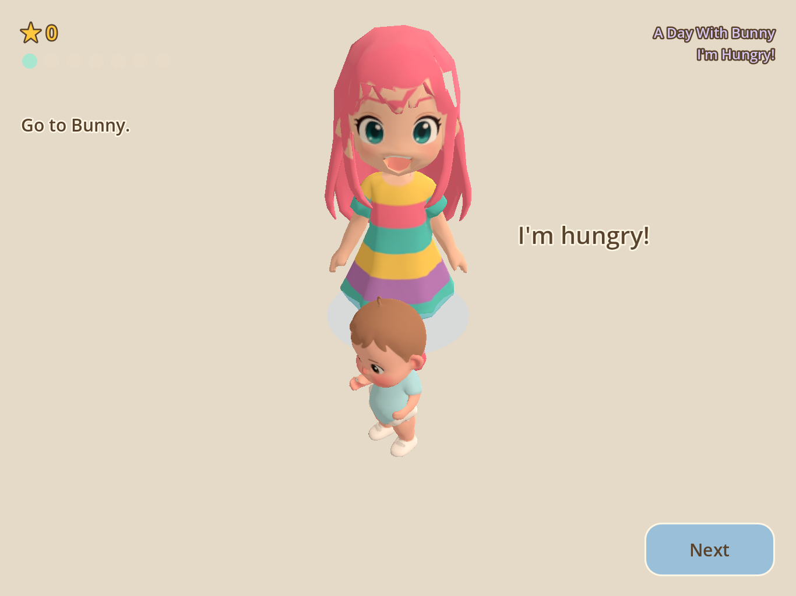
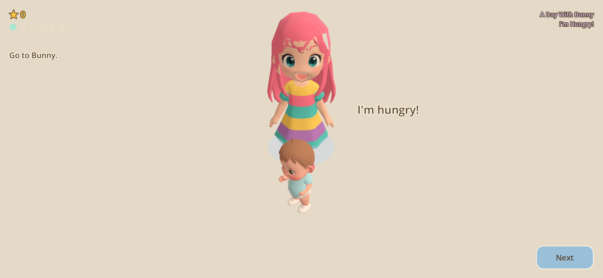
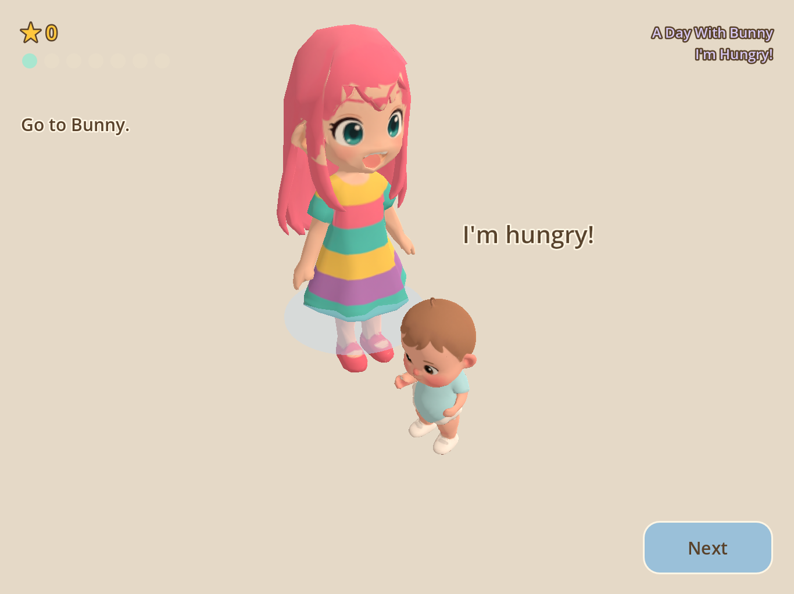
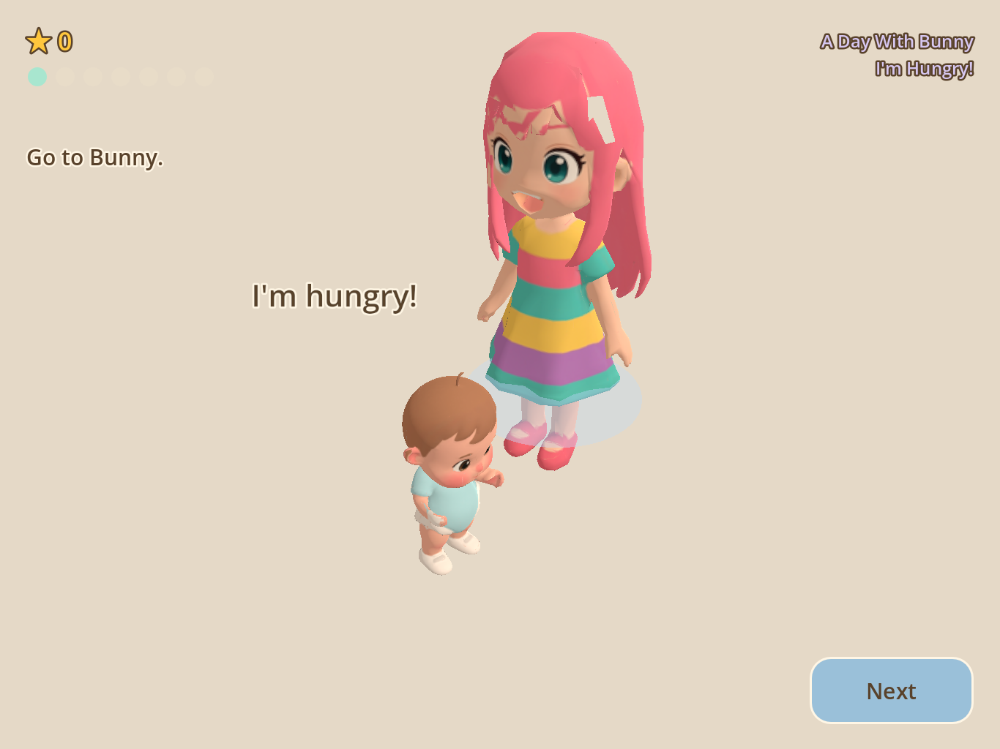
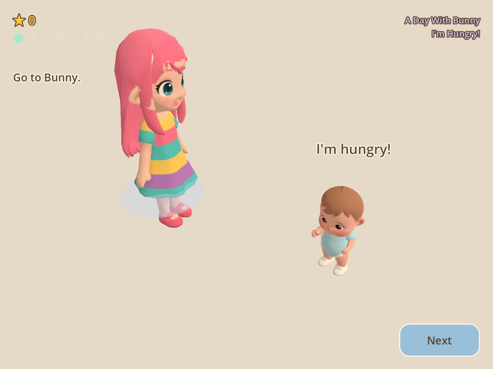
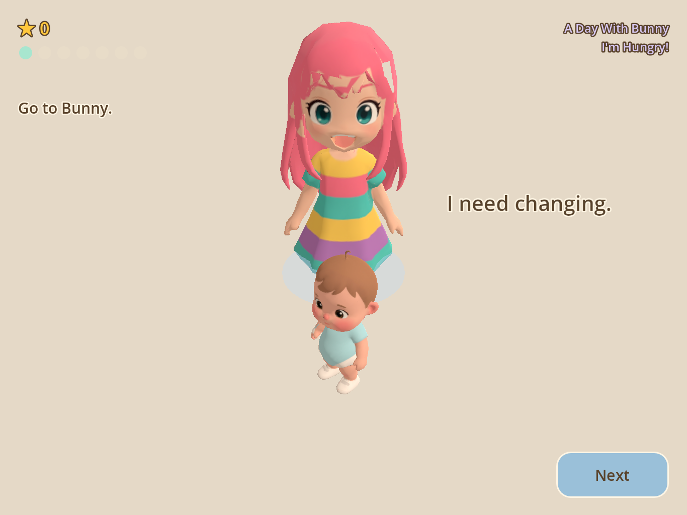

# The need bubble, verified

**Verdict: the committed change did not work. It has been replaced, and the
replacement is photographed below.**

Bunny's need line ("I'm hungry!") is a billboarded `Label3D` over his head. He is
0.78 m tall; Aliz, who comes and stands next to him, is more than twice that. An
earlier pass raised the bubble to clear his head, which only moved it from her
hair onto her chest, so a second pass made it step SIDEWAYS, away from whichever
side she was on (`_place_bubble()` in `game/scripts/care/child_actor.gd`).

That second change was committed without ever being rendered. This document is
the render. It is a FAIL for the committed version, with the frames, and a PASS
for what is there now, with the frames.

---

## 1. How the frames were produced

`game/tests/shots_bubble.gd`.

```
Godot --path game --script res://tests/shots_bubble.gd -- ipad   1366x1024
Godot --path game --script res://tests/shots_bubble.gd -- iphone 2340x1080
```

The bubble is only on screen when three things hold at once: Bunny has an active
need, Aliz is beside him, and the beat's close-up is being held. A room
screenshot shows none of it. So the harness:

1. resets the profile and ends the first-run tour (a forced level on a fresh
   profile otherwise renders the tour's caption over everything);
2. loads the real `scenes/house/house_world.tscn` and enters the bedroom;
3. starts the real `imHungry` mission and reaches its first beat,
   `bunnyIsHungry`, by standing Aliz on the target's own `InteractionPoint` --
   the position the game walks her to -- and calling the director's `_reach_beat()`;
4. **freezes the director**, because that beat completes on arrival and the
   close-up would be released a frame later;
5. moves Aliz, then calls the director's own `_update_focus()` -- the function
   its `_process` calls every frame -- so the shot is composed by the game, at
   the game's margin, with the game's radius;
6. measures, asserts, and captures.

Nothing about the framing or the HUD is forced. `house_hud.gd` picks its
presentation mode off the live camera radius, and every frame below reports
`hudMode=FEED` at `radius=0.90`, which is what a `goAndDo` beat composes.

### The resolution rule, honoured

`--resolution 2340x1080` is a request the window manager clamps (to 1686x935 on
this machine), and the camera solves its distance from the aspect ratio, so a
clamped run photographs a 1.80 composition and files it as evidence for a 2.17
one. The world is therefore hosted in a `SubViewport` of exactly the asked-for
size and captured from its texture. Every PNG's dimensions are read back off the
written image and printed, and the harness fails if they differ from the request.

**Verified dimensions of every frame in this document** (read from the PNG IHDR):

| file | pixels | aspect |
|---|---|---|
| `shots/bubble_BEFORE_front_ipad.png` | 1366 x 1024 | 1.334 |
| `shots/bubble_BEFORE_left_ipad.png` | 1366 x 1024 | 1.334 |
| `shots/bubble_BEFORE_right_ipad.png` | 1366 x 1024 | 1.334 |
| `shots/bubble_BEFORE_abeam_ipad.png` | 1366 x 1024 | 1.334 |
| `shots/bubble_BEFORE_longline_ipad.png` | 1366 x 1024 | 1.334 |
| `shots/bubble_front_ipad.png` | 1366 x 1024 | 1.334 |
| `shots/bubble_left_ipad.png` | 1366 x 1024 | 1.334 |
| `shots/bubble_right_ipad.png` | 1366 x 1024 | 1.334 |
| `shots/bubble_abeam_ipad.png` | 1366 x 1024 | 1.334 |
| `shots/bubble_longline_ipad.png` | 1366 x 1024 | 1.334 |
| `shots/bubble_front_iphone.png` | 2340 x 1080 | 2.167 |
| `shots/bubble_left_iphone.png` | 2340 x 1080 | 2.167 |
| `shots/bubble_right_iphone.png` | 2340 x 1080 | 2.167 |
| `shots/bubble_abeam_iphone.png` | 2340 x 1080 | 2.167 |
| `shots/bubble_longline_iphone.png` | 2340 x 1080 | 2.167 |

### The five stagings

| id | where Aliz is | what it asks |
|---|---|---|
| `front` | on Bunny's own interaction point, 0.62 m behind him | the real beat, and the original defect's geometry |
| `left` | 0.40 m to his screen-left, same depth | does the line swap to his right? |
| `right` | 0.40 m to his screen-right | does it swap back? |
| `abeam` | 1.40 m to his screen-left | when she is clear, does the line come home? |
| `longline` | `front`, with the longest need line in the game | does a wider line still clear her? |

`BEFORE` frames were re-shot against the exact same stagings with the committed
`child_actor.gd` restored (`git stash`), so each pair differs only in the code
under test. Both sets were captured after another agent's lighting change landed,
so the tone is consistent within this document.

---

## 2. BEFORE — the committed change, and why it is a FAIL

The numbers come straight from the harness:

| staging | Aliz's offset | bubble, local x | bubble, world x | verdict |
|---|---|---|---|---|
| `front` | +0.00 | **+0.52** | **-0.52** | inverted (see below) |
| `left` | -0.40 | **+0.52** | **-0.52** | **on her side** |
| `right` | +0.40 | **+0.52** | **-0.52** | right by accident |
| `abeam` | -1.40 | **+0.52** | **-0.52** | stranded over bare floor |
| `longline` | +0.00 | **+0.52** | **-0.52** | unchanged |

The bubble's position is **identical in all five frames, to the centimetre.** It
does not move. Two separate defects produce that:

**1. World in, local out.** The code compared the caregiver's world x against
Bunny's and then wrote the result into `_bubble.position`, which is the child's
LOCAL frame. `house_world.tscn` authors Bunny yawed 180 degrees in the bedroom
(`Transform3D(-1, 0, 0, 0, 1, 0, 0, 0, -1, 0.55, 0, 0.95)`), so local +x is world
-x and the sign came out backwards. Told she was on his left, it moved the line
onto her. Read the table: local `+0.52` renders as world `-0.52`.

**2. Never re-evaluated.** `_place_bubble()` was called only from `_refresh()` --
a need change or an activity change. Aliz walking over is neither. So the side
was chosen once, during `build()`, against wherever she happened to be spawned,
and then never again for the rest of the session. The side-swap the change was
written to perform could not happen in gameplay at all.



`shots/bubble_BEFORE_left_ipad.png` — 1366 x 1024. Aliz is 0.40 m to Bunny's
screen-left. **"I'm hungry!" is printed across her dress.** This is the exact
defect the change claimed to fix, still present after it.



`shots/bubble_BEFORE_front_ipad.png` — 1366 x 1024. The real beat's staging. This
one happens to look acceptable, which is why it survived review: with her
directly behind him a fixed step in any direction clears her, and the frame gives
no hint that the rule underneath is inverted and frozen.



`shots/bubble_BEFORE_abeam_ipad.png` — 1366 x 1024. She is 1.40 m away, in no
danger of overlapping anything, and the line is still shoved to one side, 229 px
from Bunny's head and floating over empty floor. It reads as belonging to the
room rather than to the child.

**Verdict on the committed change: FAIL.** It does not swap sides; in the bedroom
it swaps the wrong way; and it never re-evaluates, so in a real session it never
swaps at all.

---

## 3. The replacement

In `game/scripts/care/child_actor.gd`:

* the side is chosen along the **camera's** horizontal axis (asked of the live
  camera, not assumed to be world +x), which is what "beside her on screen"
  actually means;
* the answer is converted out of world space into the child's own frame before it
  is written, so a yawed child steps the right way;
* `live()` re-runs the placement every frame while the line is visible, so it
  follows a caregiver who walks;
* the rule is stated as the thing actually wanted -- a clearance between the
  line's centre and hers -- and the step is whatever is left over:

  ```
  step = max(0, clearance - |how far to the side she already is|)
  clearance = CAREGIVER_HALF_WIDTH + half the rendered line width + margin
            = 0.30 + 0.27 + 0.12 = 0.69 m   for "I'm hungry!"
            = 0.30 + 0.38 + 0.12 = 0.80 m   for "I need changing."
  ```

  which is continuous: it goes to zero exactly as she walks clear, so there is no
  threshold to flicker across and no hysteresis to tune. The line comes back over
  Bunny's own head, which is where it reads as his.

Two related bugs were fixed in passing, both in the same file:

* **`Node3D.global_position` out of the tree.** `build()` legitimately runs before
  the actor is parented (`get_activity_target()` reaches it during
  `place_in_room`), where `global_position` logs an error and silently answers
  `(0, 0, 0)` -- a wrong answer, not no answer. This is the log flood the
  coordinator reported. `_place_bubble()` and `_attend_to_caregiver()` now read
  through `scripts/navigation/spatial_util.gd`, which exists for exactly this.
* **`_find_caregiver()` latched a miss it could not have made.** One failed walk
  up the ancestry and it answered null for the rest of the session. An actor built
  before it was parented had nothing to walk, latched anyway, and would never find
  Aliz again -- no attention turn, and a bubble that dodges nobody. It no longer
  latches when there was no ancestry to search, and the miss is retired on
  `NOTIFICATION_ENTER_TREE`.

---

## 4. AFTER — the frames, and what I judge of each

### The real beat, both framings



`shots/bubble_front_ipad.png` — **1366 x 1024**. Aliz on Bunny's interaction
point, `hudMode=FEED`, `radius=0.90`.

* **Does not obscure Aliz:** PASS. The line sits 345 px from her chest; its left
  edge clears her arm by roughly 70 px.
* **Does not obscure Bunny:** PASS. He is in the lower middle, untouched.
* **Readable:** PASS. Ink on a cream outline against the cream wall, full size.
* **Inside the viewport:** PASS. Anchor at (1002, 403) in 1366 x 1024.
* **HUD:** PASS. FEED mode puts "Go to Bunny." on the left rail at y 160..268 and
  the star row above it; the line is at y 403 on the opposite side of the frame.
  Nothing overlaps.



`shots/bubble_front_iphone.png` — **2340 x 1080**, a true 2.167 aspect rendered
through a `SubViewport`. Same verdicts; anchor at (1506, 425), 364 px from her
chest. The wider frame moves the HUD rail further from the line, not closer.

### The side-swap




`shots/bubble_left_ipad.png` and `shots/bubble_right_ipad.png` — both
**1366 x 1024**.

| staging | Aliz's offset | bubble's world offset | |
|---|---|---|---|
| `left` | -0.40 | **+0.29** | opposite side |
| `right` | +0.40 | **-0.29** | opposite side |

**The side-swap works.** The two frames are mirror images, the signs are
opposite in both, and the line is 330 px from her chest and 182 px from Bunny's
head in each -- close enough to him to read as his, clear of her by a wide
margin. The same pair at 2340 x 1080 gives +0.29 / -0.29 and 348 px / 192 px.

### Standing down



`shots/bubble_abeam_ipad.png` — **1366 x 1024**. She is 1.40 m to one side, so
there is nothing to dodge and the step is zero: the line sits directly over
Bunny's head, 109 px from it. This is the best-reading frame of the set and the
one the old fixed-size step could never produce.

### The longest line



`shots/bubble_longline_ipad.png` — **1366 x 1024**. "I need changing." is the
widest line `child_needs.gd` can put on the bubble (~0.76 m against ~0.54 m for
"I'm hungry!"). Because the clearance is derived from the rendered width, it
steps 0.80 m instead of 0.69 m and still clears her; a fixed step sized for the
short line would have left this one across her chest. The 2340 x 1080 version is
`shots/bubble_longline_iphone.png`.

---

## 5. What is asserted, so it cannot regress quietly

`game/tests/cases/test_bubble_placement.gd` (new, in the 120-case suite):

* it steps away from the caregiver, symmetrically, at the authored height;
* **a child yawed 0, 90, 180 and -120 degrees all step the right way** -- the
  world/local regression, which fails on the committed code;
* **it follows a caregiver who moves**, driving only `live()` and never touching
  the need or the activity -- the never-re-evaluated regression;
* it stands down when she is clear, and the step grows monotonically as she
  closes (no snap);
* a longer line steps further, and both clear her half-width;
* an actor built outside the tree does not guess a side and finds the caregiver
  once it is parented;
* the line is visible only when there is a need.

`game/tests/shots_bubble.gd` also asserts rather than only printing: bubble
visible, bubble has text, bubble inside the frame with a 24 px margin, bubble at
least 90 px from the caregiver's chest, and every PNG exactly the requested size.
It exits non-zero otherwise -- it is how the BEFORE run was caught.

---

## 6. Test status at hand-off

| check | result |
|---|---|
| `tests/run_tests.gd` | **PASS — 120 case(s), 0 failure(s)**, one of which (`bubble_placement`) is new here |
| `tests/smoke_mission01.gd` | **SMOKE PASS** — 7 beats, 2 care mini-games by gesture, hunger 55 -> 0 |
| `tests/smoke_mission01.gd -- snackTime` | **SMOKE PASS** — 8 beats, hunger 55 -> 0 |
| `tests/shots_bubble.gd -- ipad 1366x1024` | **BUBBLE SHOTS OK** |
| `tests/shots_bubble.gd -- iphone 2340x1080` | **BUBBLE SHOTS OK** |

No test was weakened or skipped. The log flood the coordinator reported from
`_place_bubble()` is gone.

---

## 7. Not fixed here, and worth someone's attention

* **The `front` staging is the one the game actually plays, and it is the one the
  rule can do least about.** With Aliz directly behind a child a third her
  height, the only place the line can go is out to the side; it ends up ~340 px
  from Bunny's head at the close-up, which reads acceptably but not obviously as
  his. A speech-bubble tail, or a bubble anchored to his head with the text
  wrapping away from her, would settle it properly. Out of scope for a
  verification pass.
* **`CAREGIVER_HALF_WIDTH` is a constant (0.30 m), measured off these frames.** It
  is the one number here that is not derived. If Aliz's silhouette changes, it
  has to change with her; nothing fails if it does not, the bubble just sits
  closer to her.
* **The side is latched inside a 0.12 m dead zone.** With her standing exactly
  behind him the line keeps whichever side it was last on rather than inventing
  one, so which side the `front` frame shows depends on which way she approached.
  That is deliberate -- the alternative is a 1.4 m jump as she crosses his centre
  line -- but it does mean the `front` shot is only reproducible for a given
  approach, which the harness pins by resetting the profile.
